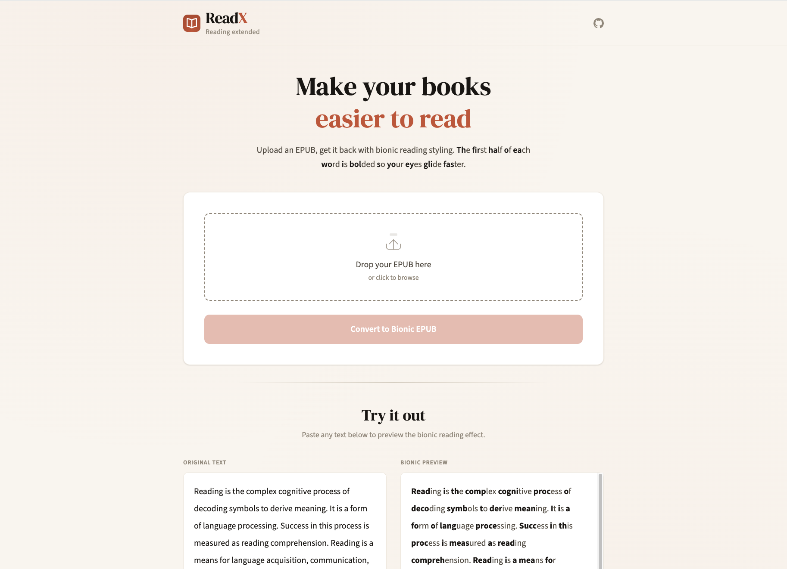

# ReadX

Reading extended. A web application that applies bionic reading styling to EPUB books, making text easier and faster to read by bolding the first part of each word.

Upload an EPUB file, get it back with bionic reading applied.

Built with Clojure and ClojureScript using [clojure-stack-spa](https://github.com/abogoyavlensky/clojure-stack-spa).

## Preview



## Development

Install Java, Clojure, Babashka, Node and other tools manually or via [mise](https://mise.jdx.dev/):

```shell
mise trust && mise install
```

First, run JS and CSS build in watch mode for local development:

```shell
npm i
bb ui-dev
```

JS and CSS assets will be served from `http://localhost:8000/assets/` and will be automatically rebuilt on changes.

In a separate terminal or your editor run server from built-in REPL:

 ```shell
bb clj-repl 
(reset)
````

The API server should be available at `http://localhost:8000`.

## Project management

Check all available commands:

```shell
bb tasks
```

Run lint, formatting and tests:

```shell
bb check
```

Check outdated dependencies:

```shell
bb outdated
```

## Deployment

For detailed deployment instructions, refer to the documentation:

- [Kamal](https://stack.bogoyavlensky.com/docs/spa/kamal)
